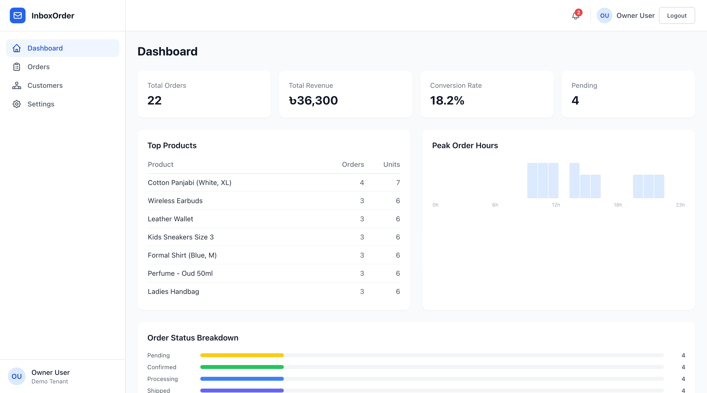
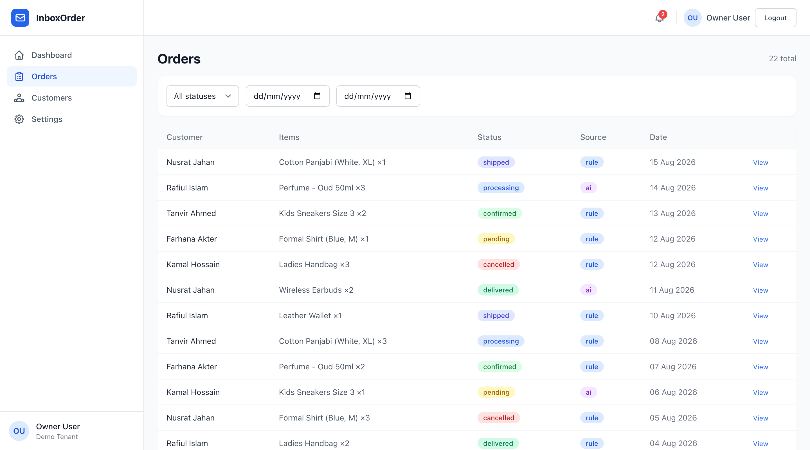
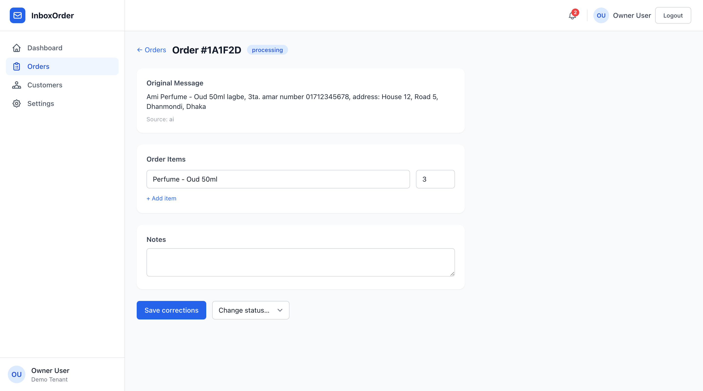
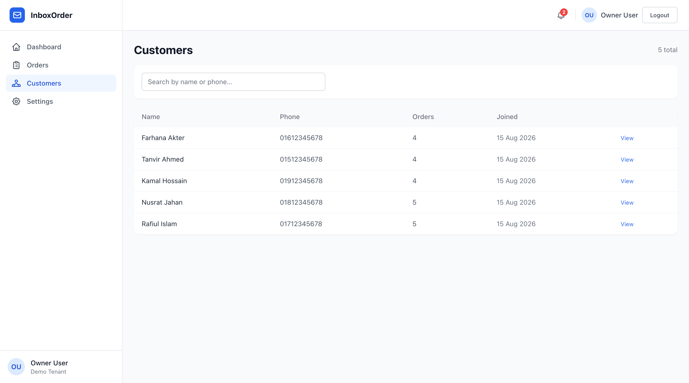
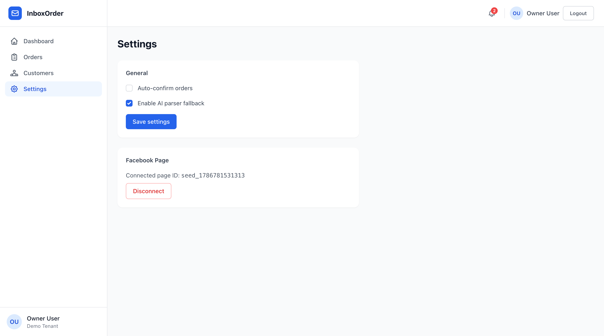
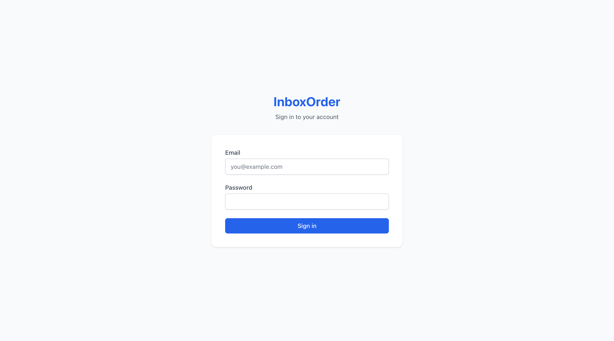

<div align="center">

# InboxOrder

**Turn Facebook Messenger chaos into a structured order pipeline.**

A production-grade, multi-tenant SaaS that reads incoming Messenger messages, extracts order intent with a hybrid rule-based + AI parser, and gives your team a real-time dashboard to fulfill orders — no manual copy-pasting from chat threads.

[](https://www.typescriptlang.org/)
[](https://nodejs.org/)
[](https://vuejs.org/)
[](https://www.mongodb.com/)
[](https://redis.io/)
[](https://socket.io/)
[](LICENSE)

</div>

---

## Why this exists

For small e-commerce sellers across South Asia, Facebook Messenger *is* the storefront — customers message a page to order, and staff manually read each thread, guess the product/quantity/phone/address, and type it into a spreadsheet. It's slow and error-prone, and nothing is searchable, filterable, or trackable.

**InboxOrder replaces that spreadsheet.** Every inbound message is run through a rule-based parser first (fast, free, tuned for mixed Bangla/English text); anything it isn't confident about falls back to an AI parser. The result is a structured, editable order that shows up on a live dashboard in real time — with the original message and a confidence score attached, so staff can trust or correct it in one click.

---

## Screenshots

| Dashboard — orders, revenue, conversion, peak hours | Orders — filterable, real-time list |
|---|---|
|  |  |

**Order detail — original Messenger text, AI/rule source, editable items, one-click status change:**



| Customers — auto-created from Messenger senders | Settings — parser + Facebook page connection |
|---|---|
|  |  |

**Sign in:**



---

## How it works

```
Facebook Messenger message
        │
        ▼
POST /api/webhook/facebook   (X-Hub-Signature-256 verified)
        │
        ▼
Store raw message  ──►  Enqueue job (BullMQ: messageQueue)
                              │
                              ▼
                    Rule-based parser runs first
                    (intent, product, qty, BD phone, address)
                              │
                confidence ≥ 0.7?──yes──► use rule result
                              │
                              no
                              ▼
                    AI parser (HTTP, JSON-safe, 10s timeout)
                    fails? ──► fall back to rule result, log to aiLogs
                              │
                              ▼
                    Save ParsedOrder (source: rule | ai)
                    Create Order (status: pending)
                              │
                              ▼
              Emit Socket.io `order:new`  ──►  Dashboard updates live
```

Every collection is scoped by `tenantId` — one Facebook page = one tenant. Nothing crosses tenant boundaries, at the query layer or the Socket.io room layer.

---

## Tech stack

| Layer | Choices |
|---|---|
| Backend | Node.js, Express, TypeScript (strict) |
| Database | MongoDB + Mongoose, compound indexes on every hot query path |
| Queues | BullMQ + Redis — message processing, webhook retries, notifications |
| Real-time | Socket.io, rooms scoped per tenant |
| Frontend | Vue 3 (Composition API), Vite, Pinia, Vue Router |
| Styling | Tailwind CSS |
| Auth | JWT access + refresh tokens, bcrypt password hashing |
| Security | Helmet, per-route rate limiting, webhook signature verification |

---

## Key features

- **Hybrid parser, not just an LLM wrapper** — a fast rule-based extractor (Bangla + English, Bangladesh phone format) handles the obvious cases for free; AI is only called when confidence drops below threshold.
- **Confidence-scored, human-correctable** — every parsed order keeps its original message and confidence score, and staff can edit and save corrections without losing the AI/rule audit trail.
- **Real-time by default** — new orders, status changes, and webhook failures push to the dashboard over Socket.io the moment they happen.
- **True multi-tenancy** — every collection, query, and socket room is scoped to `tenantId`; one deployment serves many Facebook pages safely.
- **Analytics out of the box** — revenue, conversion rate, top products, and peak order hours computed via MongoDB aggregation pipelines.
- **Resilient queues** — BullMQ workers with exponential backoff retries and dead-letter logging for both message processing and webhook delivery.

---

## Quickstart

**Requirements:** Node 18+, MongoDB, Redis (native or Docker).

```bash
git clone https://github.com/wpulse2024/InboxOrder.git
cd InboxOrder
npm install
```

Create `.env` in the repo root (copy into `backend/.env` and `frontend/.env` too, since each workspace loads its own):

```env
PORT=3000
NODE_ENV=development
MONGODB_URI=mongodb://localhost:27017/inboxorder
REDIS_URL=redis://localhost:6379

JWT_SECRET=change_me_32_chars_minimum
JWT_REFRESH_SECRET=change_me_32_chars_minimum

FACEBOOK_APP_SECRET=your_fb_app_secret
FACEBOOK_VERIFY_TOKEN=your_fb_verify_token

AI_API_KEY=your_ai_api_key
AI_API_URL=https://api.anthropic.com/v1/messages

VITE_API_BASE_URL=http://localhost:3000/api
VITE_SOCKET_URL=http://localhost:3000
```

Seed a demo account, then start both apps:

```bash
cd backend && npm run seed        # creates Demo Tenant + owner/admin/staff users
npm run seed:demo                 # optional: populates realistic customers/orders for a full demo
cd ..
npm run dev                       # runs backend (:3000) and frontend (:5173) together
```

Sign in at `http://localhost:5173` with:

```
owner@gmail.com / 123456
admin@gmail.com / 123456
staff@gmail.com / 123456
```

### Docker alternative

```bash
npm run docker:up      # mongo + redis + backend + frontend
npm run docker:logs
npm run docker:down
```

---

## Project structure

```
InboxOrder/
├── backend/
│   └── src/
│       ├── config/       # env, db, redis, socket config
│       ├── modules/      # auth, webhook, orders, customers, analytics, settings, notifications
│       ├── queue/        # BullMQ workers and processors
│       ├── parser/       # rule-based + AI hybrid parser
│       ├── realtime/     # Socket.io event emitters
│       ├── middleware/   # auth, error, rate-limit, tenant scoping
│       ├── models/       # Mongoose schemas
│       └── seeds/        # demo tenant/user + demo order data
└── frontend/
    └── src/
        ├── api/          # Axios service layer
        ├── stores/       # Pinia stores (auth, orders, customers, notifications, analytics)
        ├── views/        # Dashboard, Orders, OrderDetail, Customers, Settings, Login
        ├── components/   # Reusable UI
        ├── composables/  # Socket.io connection, etc.
        └── router/       # Vue Router + auth guards
```

---

## License

MIT — see [LICENSE](LICENSE).
