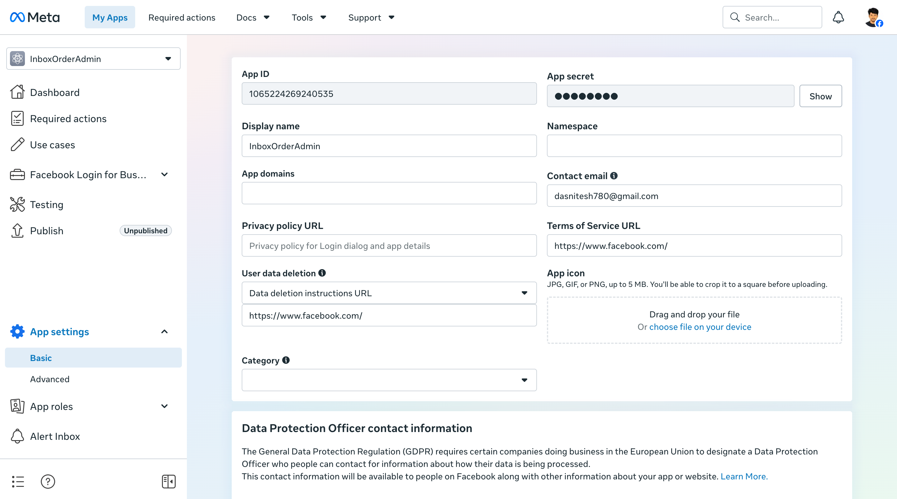
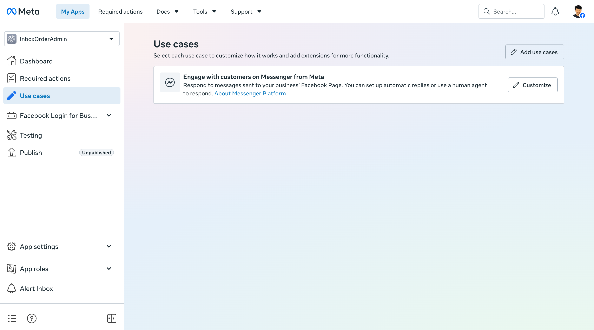
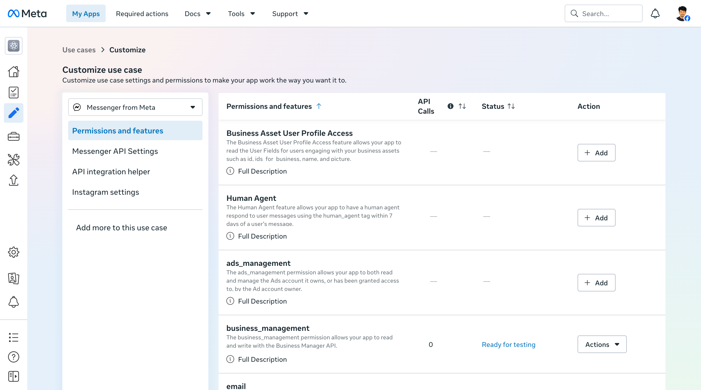
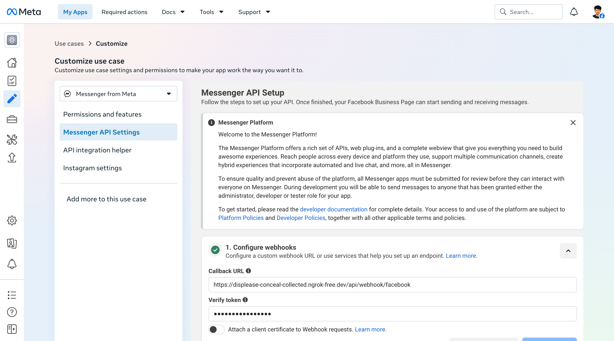
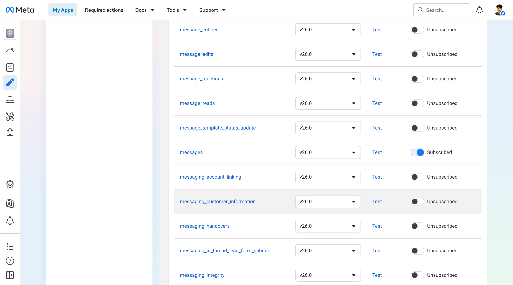
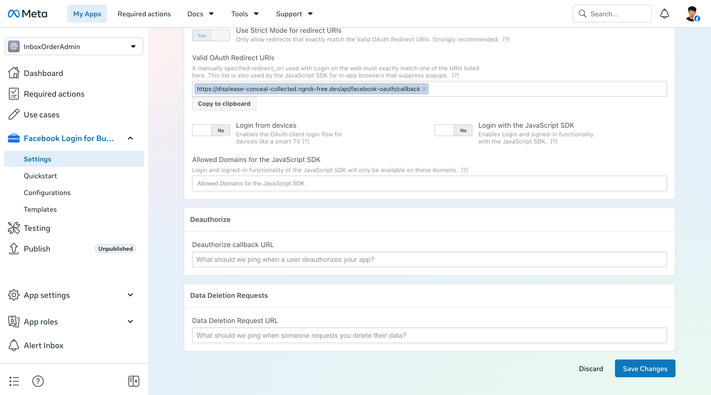
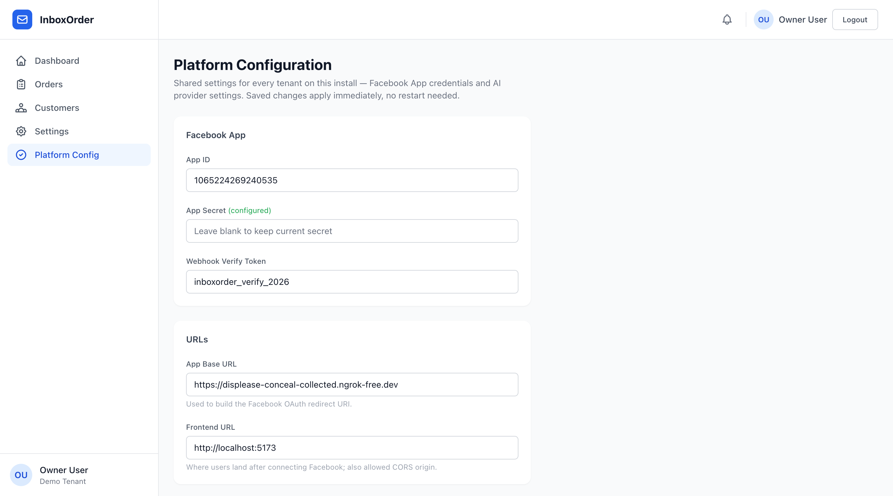
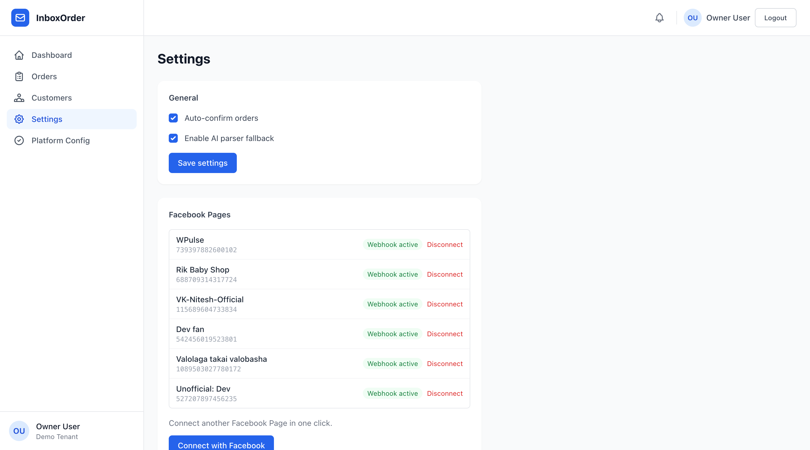

# Admin Guide — Facebook App Setup (one-time, platform-wide)

**Audience:** the person deploying/operating InboxOrder (you). Done **once**, ever — not per tenant, not per page owner. This registers a single Meta App that every business using your InboxOrder instance authorizes through, the same way ManyChat/Chatfuel/Buffer do it.

Page owners never see any of this. They just click "Connect with Facebook" — see [`owner-connect-facebook-page.md`](./owner-connect-facebook-page.md).

> Meta redesigned the developer console around **"Use cases"** instead of the old "Products" picker. The steps below match the current (2026) UI — screenshots included. If you're following an older tutorial that says "add the Messenger product," that's the same destination, different door.

---

## 1. Create the Meta App

1. Go to [developers.facebook.com](https://developers.facebook.com) → **My Apps** → **Create App**
2. Type: **Business**
3. Name it (e.g. `InboxOrderAdmin`) and finish creation.
4. Note the **App ID** and **App Secret**: sidebar → **App settings** → **Basic**.



The App Secret is masked by default (dots + a **Show** button). Revealing it makes Meta re-prompt for your account password — that's Meta's account credential, not the App Secret, so type it yourself rather than handing it to any automation.

## 2. Add the Messenger use case

Sidebar → **Use cases**. A fresh Business app doesn't come with Messenger attached — click **Add use cases** if you don't already see "Engage with customers on Messenger from Meta" listed, then **Customize** on that card.



"Customize" opens a use-case-scoped settings area with its own tabs: **Permissions and features**, **Messenger API Settings**, **API integration helper**, **Instagram settings**. Everything below happens inside this screen.

## 3. Add the required permissions

Tab: **Permissions and features**. Each permission your app calls at OAuth time must be individually **Added** here first — a permission that's never been added produces a real `Invalid Scopes` error on the OAuth consent screen, not a warning, not a lint. This isn't documented anywhere obvious; it's just how the use-case UI gates scopes now.

Click **Add** on each of:

- `pages_show_list`
- `pages_messaging`
- `pages_manage_metadata`
- `pages_read_engagement`

Each one flips from "Add" to a green **Ready for testing** status once added — that status is what makes the scope usable in the OAuth `scope=` parameter while the app is in Development Mode.



## 4. Configure the Messenger webhook

Tab: **Messenger API Settings** → section **1. Configure webhooks**.

- **Callback URL**:
  ```
  {APP_BASE_URL}/api/webhook/facebook
  ```
  e.g. `https://api.yourdomain.com/api/webhook/facebook` (or your ngrok URL in local dev)
- **Verify token**: any string you choose — this becomes `FACEBOOK_VERIFY_TOKEN` below.



Click **Verify and save**. Meta immediately sends a `GET` challenge request to the Callback URL — your backend must already be reachable and answering `hub.challenge` correctly before this step, or the save fails.

Then scroll to **Webhook fields** (same tab, further down) and toggle **Subscribe** on:

- `messages`
- `messaging_postbacks`



This webhook is **one shared endpoint for every tenant** — the backend resolves which tenant/page a message belongs to from the Page ID in the payload (`webhook.service.ts` → `resolveTenantId`, checks the `FacebookPage` collection). You never register a separate webhook per business.

## 5. Configure Facebook Login for Business

Sidebar → **Facebook Login for Business** (click the group header to expand it if the child items look unclickable — Meta's sidebar sometimes renders collapsed children as visible-but-inert) → **Settings**.

Add a **Valid OAuth Redirect URI**:
```
{APP_BASE_URL}/api/facebook-oauth/callback
```
e.g. `https://api.yourdomain.com/api/facebook-oauth/callback`



Save. This must be **byte-identical** to the redirect URI your backend sends in the OAuth `redirect_uri` parameter (built from `APP_BASE_URL`) — a trailing slash mismatch alone will fail the OAuth exchange.

## 6. Enter the values in Platform Config (no `.env` editing, no restart)

Log in as a platform admin and go to **Platform Config** in the sidebar (`/admin/config`). Enter:

- **Facebook App** → App ID, App Secret, Webhook Verify Token (from steps 1 and 4)
- **URLs** → App Base URL, Frontend URL



Click **Save configuration** — it takes effect immediately for every tenant, no backend restart needed. The App Secret and AI API Key fields are write-only: once saved, the form shows "(configured)" instead of the value, and you only need to re-enter them when rotating a credential.

**Becoming a platform admin:** the first admin is granted via the `PLATFORM_ADMIN_BOOTSTRAP_EMAIL` env var (set it to your login email, boot the server once — it's idempotent and safe to leave set). Every platform admin after that can be granted the same way, or by flipping `isPlatformAdmin: true` directly on their `User` document. This flag is separate from the per-tenant `owner`/`admin`/`staff` role — it grants cross-tenant access to shared config, not tenant data.

These values are shared by every tenant — that's the whole point of OAuth: Facebook, not you, issues each business owner their own Page Access Token when they click through the consent screen.

**Fallback:** if `/admin/config` has never been filled in (e.g. a fresh deploy before first login), the backend falls back to the equivalent `.env` vars (`FACEBOOK_APP_ID`, `FACEBOOK_APP_SECRET`, `FACEBOOK_VERIFY_TOKEN`, `APP_BASE_URL`, `FRONTEND_URL`) — see `backend/src/config/platformConfig.ts`. Once a value is saved in the UI, it takes priority over the env var.

## 7. Verify end-to-end with a real "Connect with Facebook"

From a tenant's **Settings** page, click **Connect with Facebook**. You'll walk through:

1. Facebook identity consent ("Continue as ...")
2. A permissions review screen listing the four scopes above
3. A Page-picker ("Choose the Pages you want [App] to access") — **opt in to all current and future Pages** vs. **current Pages only** is a real, consequential choice on the account's actual Pages, not a rubber-stamp click
4. Redirect back to `{APP_BASE_URL}/api/facebook-oauth/callback?code=...`, then to the frontend's Settings page with the Page(s) pre-checked
5. Click **Connect N pages**

A successful run shows every connected Page with a green **Webhook active** badge — confirming the backend exchanged the code, stored the Page Access Token (encrypted), and auto-subscribed the Page to your webhook.



If step 2 fails with `Invalid Scopes: <permission>`, go back to step 3 — that permission was never Added on Meta's side.

## 8. Go live

- While in Development Mode, only Meta accounts added as **Testers/Developers/Admins** on the App can complete OAuth.
- To let arbitrary users (your 10k signups) connect their own pages, submit the app for **App Review** for the four permissions above, then switch the app to **Live**.
- No further backend changes needed once approved — the OAuth flow and webhook are already multi-tenant.

## 9. Operational checks

| Check | How |
|---|---|
| Webhook reachable | `GET {APP_BASE_URL}/api/webhook/facebook?hub.mode=subscribe&hub.verify_token=<token>&hub.challenge=CHALLENGE_ACCEPTED` → expect `CHALLENGE_ACCEPTED` |
| OAuth redirect URI matches | Must be byte-identical between Meta App settings and `APP_BASE_URL` env var |
| A tenant's page not receiving messages | Check `FacebookPage.webhookSubscribed` for that page — `false` means the auto-subscribe call failed (see `facebookOAuth.controller.ts` → `subscribePageToWebhook`) |
| Rotating the App Secret | Update it in `/admin/config` — takes effect immediately for webhook signature verification, no restart |
| `Invalid Scopes` on OAuth consent | Go to Use cases → Customize → **Permissions and features** and click **Add** on the missing permission |

---

For the low-level per-page management API (add/rotate/remove a page's token directly, without OAuth — useful for scripting or support), see [`connect-facebook-page.md`](./connect-facebook-page.md).
